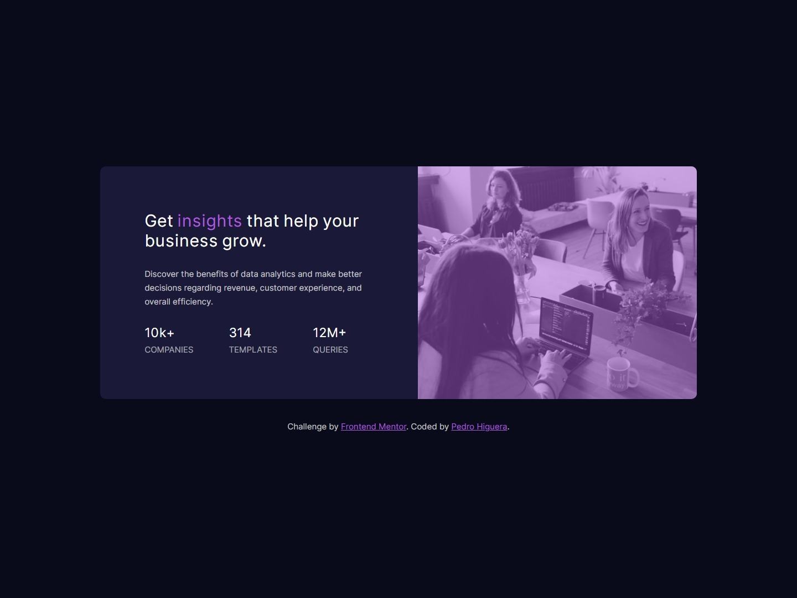
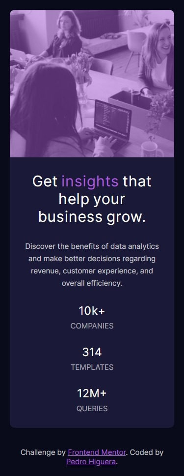

# Frontend Mentor - Stats preview card component solution

This is a solution to the [Stats preview card component challenge on Frontend Mentor](https://www.frontendmentor.io/challenges/stats-preview-card-component-8JqbgoU62). Frontend Mentor challenges help you improve your coding skills by building realistic projects. 

## Table of contents

- [Overview](#overview)
  - [The challenge](#the-challenge)
  - [Screenshot](#screenshot)
  - [Links](#links)
- [My process](#my-process)
  - [Built with](#built-with)
  - [What I learned](#what-i-learned)
  - [Continued development](#continued-development)
- [Author](#author)

## Overview

### The challenge

Users should be able to:

- This website is responsive for all sizes of screen
- The original challenge is able to mobile (375px) and desktop (1440px)

### Screenshot





### Links

- Solution URL: [Code](https://github.com/PedroHigueraG/Stats-preview-card-component)
- Live Site URL: [Website](https://pedrohiguerag.github.io/Stats-preview-card-component/)

## My process

### Built with

- Semantic HTML5 markup
- CSS
- Flexbox
- Mobile-first workflow

### What I learned

I learned about the pseudo-element ::before that is the first child of the selected item, I used it for the color of the image

```css
.card-image::before{
    content: '';
    position: absolute;
    top: 0;
    left: 0;
    right: 0;
    bottom: 0;
    background-color: hsla(277, 64%, 61%, 0.5);
    border-radius: 1rem 1rem 0 0;
}
```

### Continued development

I want to improved the mobile first concept

## Author

- Website - [PedroHigueraG](https://pedrohiguerag.xyz/)
- Frontend Mentor - [@PedroHigueraG](https://www.frontendmentor.io/profile/PedroHigueraG)
- Twitter - [@Pedrosky664](https://twitter.com/Pedrosky664)
